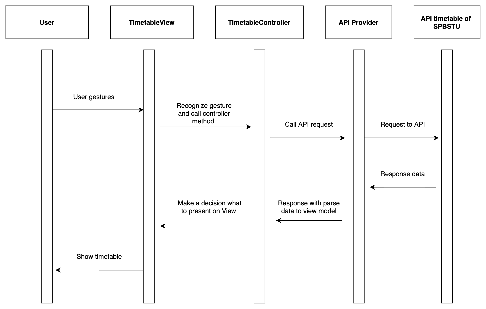
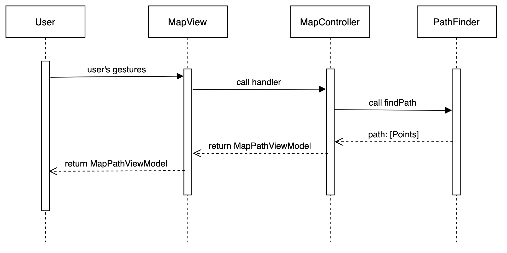
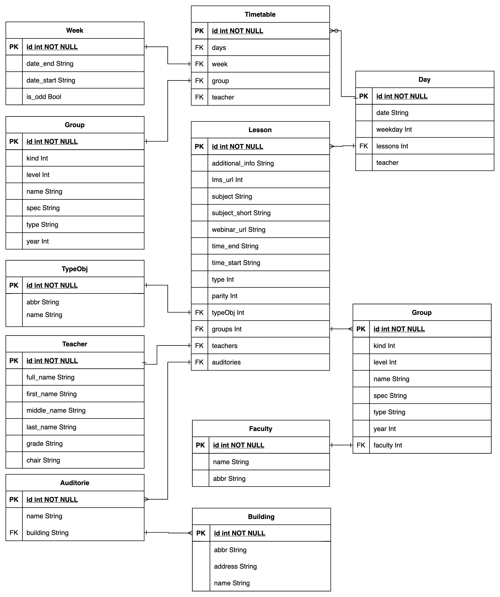

# High-Level Design

## Оглавление
* [Стэк технологий](#стэк-технологий)
* [Общая архитектура](#общая-архитектура)
* [Макет дизайна](#макет-дизайна)
* [Список API](#стэк-технологий)

## Стэк технологий

* Swift - язык программирования 
  * UIKit - отрисовка интерфейса
  * MapKit - фреймворк для работы с картами
  * Alamofire - библиотека REST запросов
* Xcode - среда разработки под iOS, WatchOS, macOS, tvOS

## Общая архитектура
### Timetable sequence diagram

Пользователь заходит в расписание и производит какие-либо действие. Эти действия 
распознаются UIControl'ом и отправляются в Control'ер, который выбирает нужный для жеста
обработчик. Например, если пользователь скролит вправо, отправляется запрос на сервер с 
нужной датой, далее ответ приводится к типу TimetableViewModel, которую отправляют 
в datasource таблицы с расписанием.

### Map sequence diagram

Пользователь выполняет действия, чтобы построить маршрут до точки. MapView 
считывает действия пользователя, отправляет на MapControll'ер. Контролер 
обращается к PathFinder'у(класс поиска маршрута и формирования точек). PathFinder 
возвращает путь, который потом преобразуется из массива точек в MapPathViewModel, 
которую обрабатывает MapView.

## Макет дизайна

### Основной экран

Основной экран приложения. На нём расположена кнопка "расписание" и поиск

### Маршрут

Подробная информация о здание, возможность просмотра его планировки и прокладывания маршрута дл него. Во 2 секции отображена информация о текущем маршруте. 

### Расписание

Всплывающее окно с расписанием, откроется после нажатия соответствующий кнопки на карте. Отображает занятия сгруппированные по дням недели.

### Настройки расписания

Позволяют выбрать источник расписания (F_tt_3)

## Список API
### Схема ответа сервера

### Расписание
Приложение будет использовать API расписания политеха
* https://ruz.spbstu.ru/api/v1/ruz/faculties - список факультетов
* https://ruz.spbstu.ru/api/v1/ruz/faculties/:facultyID/groups - список групп для факультета с *:facultyID*
* https://ruz.spbstu.ru/api/v1/ruz/teachers - список преподавателей 
* https://ruz.spbstu.ru/api/v1/ruz/:groupID/scheduler?date=:date - расписание для группы *:groupID* на неделю начинающуюся с *:date* в формате yyyy-MM-dd
* https://ruz.spbstu.ru/api/v1/ruz/:teacherID/scheduler?date=:date - расписание для преподавателя *:teacherID* на неделю начинающуюся с *:date* в формате yyyy-MM-dd

