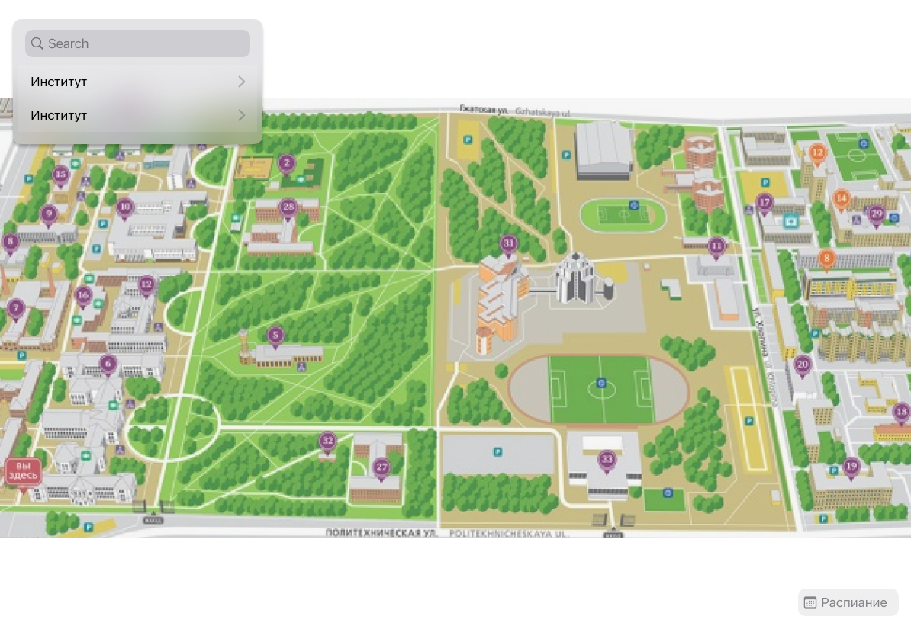
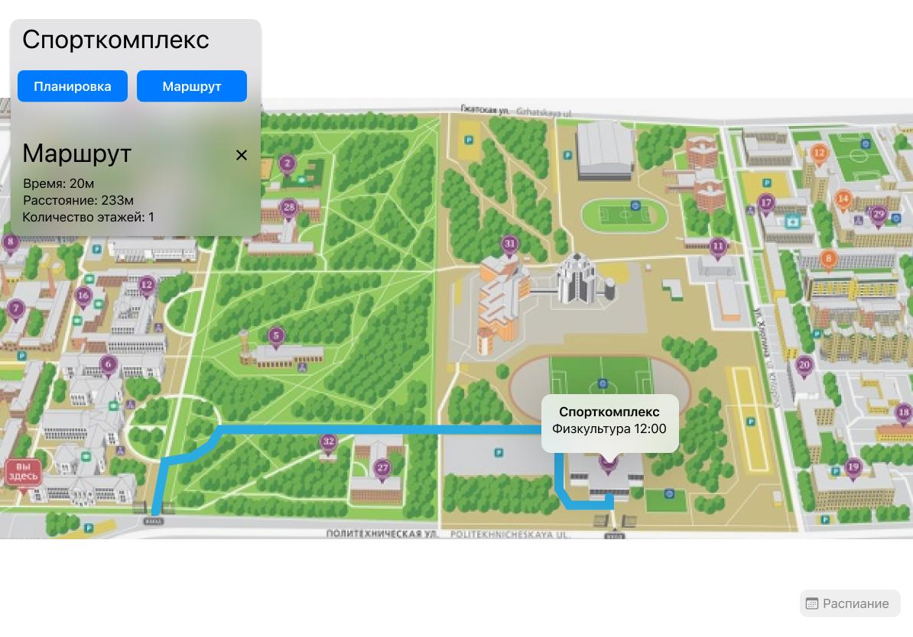
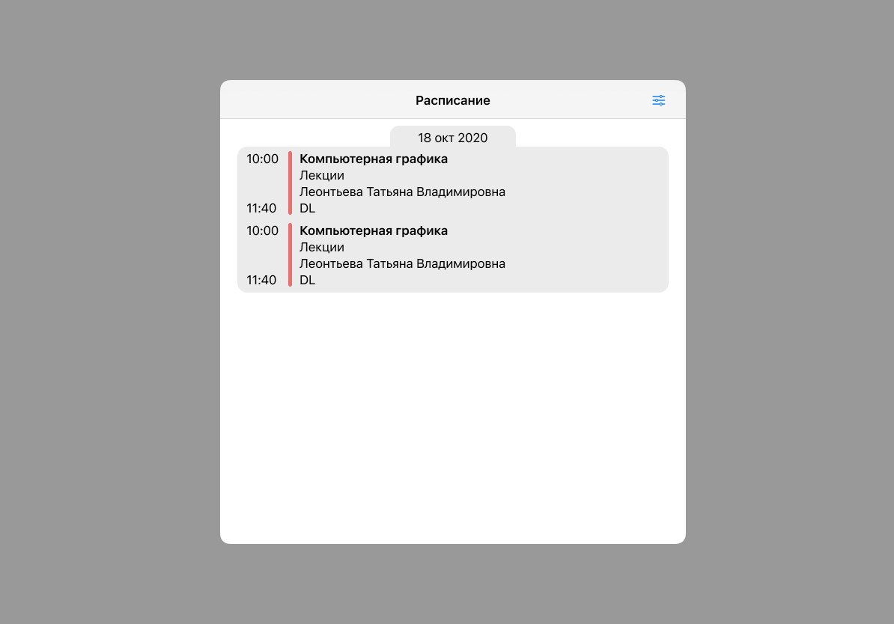
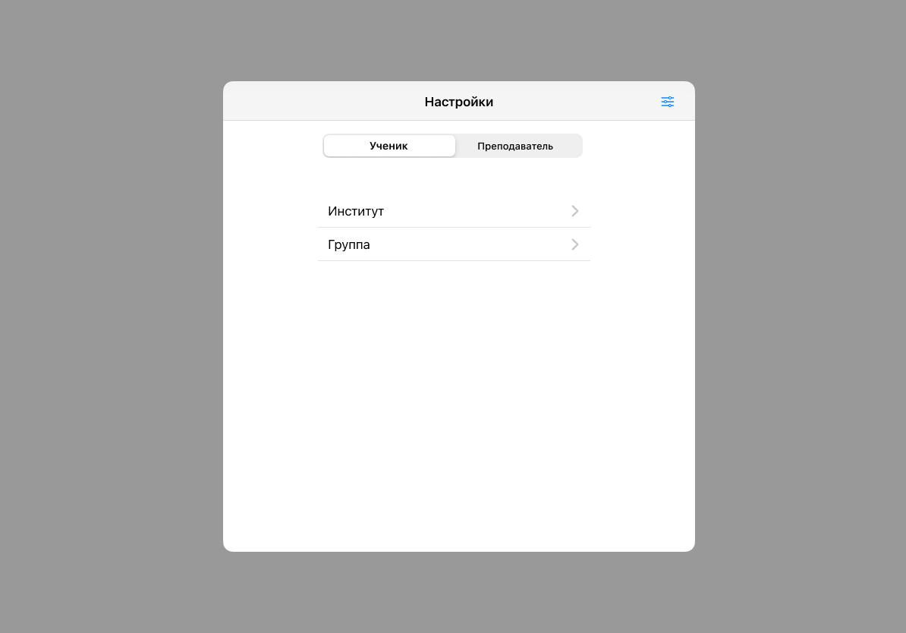

# High-Level Design

## Оглавление
* [Стэк технологий](#стэк-технологий)
* [Общая архитектура](#общая-архитектура)
* [Макет дизайна](#макет-дизайна)
* [Список API](#стэк-технологий)

## Стэк технологий

* XCode 
  * UIKit - отрисовка интерфейса
  * Swift - язык программирования
  * SkeletonView - отрисовка процесса загрузки
  * Alamofire - библиотека REST запросов

## Общая архитектура
Основным экраном будет карта. Информация отображается в SheetView (см. [макет дизайна](#макет-дизайна)). В нём отображается строка поиска, в случае наличия построенного маршрута информация о нём, подробная информация о выделенном объекте.
Поиск и просмотр информации об объекте несовместимы. 

Нажатие кнопки "планировка" (см. [макет дизайна](#маршрут)), карта общего плана меняется на карту планировки помещения. Повторное нажатие на кнопку позволяет вернуться к карте.

## Макет дизайна

### Основной экран

Основной экран приложения. На нём расположена кнопка "расписание" и поиск

### Маршрут

Подробная информация о здание, возможность просмотра его планировки и прокладывания маршрута дл него. Во 2 секции отображена информация о текущем маршруте. 

### Расписание

Всплывающее окно с расписанием, откроется после нажатия соответствующий кнопки на карте. Отображает занятия сгруппированные по дням недели.

### Настройки расписания

Позволяют выбрать источник расписания (F_tt_3)

## Список API

### Расписание
Приложение будет использовать API расписания политеха
* https://ruz.spbstu.ru/api/v1/ruz/faculties - список факультетов
* https://ruz.spbstu.ru/api/v1/ruz/faculties/:facultyID/groups - список групп для факультета с *:facultyID*
* https://ruz.spbstu.ru/api/v1/ruz/teachers - список преподавателей 
* https://ruz.spbstu.ru/api/v1/ruz/:groupID/scheduler?date=:date - расписание для группы *:groupID* на неделю начинающуюся с *:date* в формате yyyy-MM-dd
* https://ruz.spbstu.ru/api/v1/ruz/:teacherID/scheduler?date=:date - расписание для преподавателя *:teacherID* на неделю начинающуюся с *:date* в формате yyyy-MM-dd

